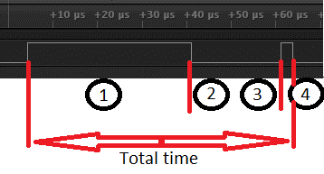
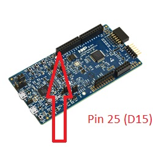
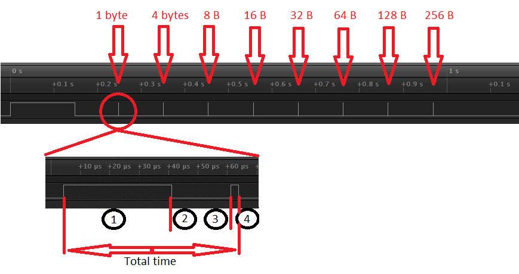

.. _RPMsgLite_sample:

RPMsg-Lite Application for performance measurement
##########################

Overview
********

This application purpose is to measure performance of the RPMsg-Lite running under Zephyr.

It consists of four stages:

| *-- Pin goes high*
| 1. M4 core (master) sends a message of a given length to the M0 core (remote),
| *-- Pin goes low*
| 2. M0 core receives the message and copies it into its local buffer,
| 3. M0 core sends a response of same length to the M4 core,
| *-- Pin goes high*
| 4. M4 core receives the response and copies it into its local buffer.
| *-- Pin goes low*
|

Then the procedure is performed again for a different message length.

Timing values are obtained by measuring the time between consecutive changes of
pin state. Total time of ping-pong transaction is measured from first rising edge
to the second falling edge.

The application is analogous to the ``openamp_timing`` example.

Building the application
*************************

To build & flash the application invoke following commands:

.. code-block:: console

    cd samples/subsys/ipc/rpmsglite_timing
    west build -b lpcxpresso54114_m4
    west flash

Open a serial terminal (minicom, putty, etc.) and connect the board with the
following settings:

- Speed: 115200
- Data: 8 bits
- Parity: None
- Stop bits: 1

Connect pin 25 on port 0 (marked as D15 Arduino pin) to the input of logic analyzer.

Reset the board and the following message will appear on the corresponding
serial port:

.. code-block:: console

    ***** Booting Zephyr OS build zephyr-v2.0.0-4-g4d77ad1b8bdc *****
    RPMsg-Lite[master] demo started
    Message 1 bytes sent successfully
    Message 4 bytes sent successfully
    Message 8 bytes sent successfully
    Message 16 bytes sent successfully
    Message 32 bytes sent successfully
    Message 64 bytes sent successfully
    Message 128 bytes sent successfully
    Message 256 bytes sent successfully
    RPMsg-Lite demo ended.

The following waveform will appear on the logic analyzer output:

Inspect each timing graph to obtain timing values for corresponding message length.

Values obtained using Saleae Logic Analyzer, GCC 7.3.1 compiler, O3 optimization:

+------------------------+-----------------+
| Message length [bytes] | Total time [us] |
+------------------------+-----------------+
|            4           |      59.47      |
+------------------------+-----------------+
|            8           |      59.92      |
+------------------------+-----------------+
|            16          |      60.75      |
+------------------------+-----------------+
|            32          |      62.42      |
+------------------------+-----------------+
|            64          |      67.44      |
+------------------------+-----------------+
|            128         |      83.02      |
+------------------------+-----------------+
|            256         |     109.38      |
+------------------------+-----------------+
